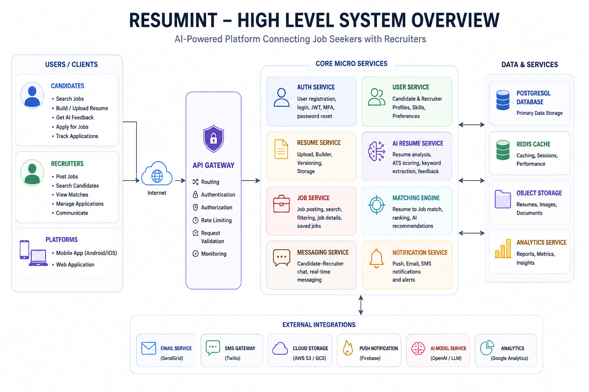

System Architecture Document (SAD)

Project Name: Resumint

Document Version: 1.0

Prepared By: Software Architecture Team

Classification: Internal Technical Documentation

---

Table of Contents

1. Introduction

2. Purpose

3. Scope

4. Architectural Goals

5. High-Level System Overview

6. Architecture Pattern

7. Logical Architecture

8. Physical Architecture

9. Component Architecture

10. Data Flow

11. Security Architecture

12. Scalability Architecture

13. Availability & Reliability

14. Technology Stack

15. External Integrations

16. Deployment Architecture

17. Future Expansion

---

1. Introduction

Resumint is an AI-powered recruitment platform designed to streamline the recruitment lifecycle for both job seekers and employers.

The platform leverages Artificial Intelligence to:

Build professional résumés

Evaluate résumé quality

Match candidates with relevant job opportunities

Assist recruiters in discovering qualified candidates

Improve recruitment efficiency through automation

---

2. Purpose

This document defines the architectural design of the Resumint platform.

It serves as the reference document for:

Software Engineers

Backend Developers

Frontend Developers

Database Engineers

DevOps Engineers

QA Engineers

Technical Leads

---

3. Scope

The architecture covers:

Mobile Application

Web Application

Backend Services

AI Services

Authentication

Database

File Storage

Notification Services

Analytics

---

4. Architectural Goals

The platform is designed to achieve:

High Availability

Scalability

Security

Maintainability

Fault Tolerance

Modular Design

API-first Development

Cloud Native Deployment

---

5. High-Level System Overview
 

---

6. Architecture Pattern

Resumint adopts a Layered Service-Oriented Architecture (SOA) with modular backend services.

The architecture consists of:

Presentation Layer

API Layer

Business Layer

AI Layer

Data Layer

---

7. Logical Architecture

Presentation Layer

Components

Android Application

iOS Application

Web Portal

Responsibilities

User Interface

Input Validation

Authentication

API Communication

---

API Layer

Responsibilities

Request Routing

Authentication

Authorization

Rate Limiting

API Versioning

---

Business Layer

Contains all application logic.

Modules include:

User Management

Recruiter Management

Candidate Management

Resume Management

Job Management

Application Management

Messaging

Notifications

---

AI Layer

Responsible for:

Resume Analysis

ATS Scoring

Resume Generation

Skill Gap Detection

Job Recommendation

Candidate Matching

Recruiter Recommendation

---

Data Layer

Stores:

Users

Companies

Resumes

Jobs

Applications

Messages

AI Results

---

8. Physical Architecture

Internet
                    |
          Load Balancer
                    |
          API Gateway Cluster
                    |
     -------------------------------
     |      |       |      |       |
 Auth User Resume Jobs AI Services
     |      |       |      |       |
     --------------------------------
                    |
             PostgreSQL Cluster
                    |
      --------------------------
      |                        |
 Object Storage          Redis Cache

---

9. Component Architecture

Authentication Service

Responsibilities

Login

Registration

JWT Generation

Password Reset

Multi-factor Authentication

---

User Service

Responsibilities

Candidate Profiles

Recruiter Profiles

Profile Updates

Skills

---

Resume Service

Responsibilities

Upload Resume

Resume Builder

Resume Storage

Resume Versioning

---

AI Resume Service

Responsibilities

Grammar Analysis

ATS Compatibility

Keyword Analysis

Resume Scoring

---

Job Service

Responsibilities

Job Posting

Job Search

Job Filtering

Saved Jobs

---

Matching Engine

Responsibilities

Resume-to-Job Matching

Candidate Ranking

Recruiter Recommendation

AI Suggestions

---

Notification Service

Responsibilities

Push Notifications

Email Notifications

SMS Notifications

---

Messaging Service

Responsibilities

Candidate-Recruiter Chat

Message History

Read Receipts

---

10. Data Flow

Candidate Registration

User

↓

Authentication

↓

Create User

↓

Create Candidate Profile

↓

Database

↓

Success Response

---

Resume Analysis

Upload Resume

↓

Resume Service

↓

AI Analysis Engine

↓

Resume Score

↓

Database

↓

Return Analysis

---

Job Matching

Candidate Profile

↓

AI Matching Engine

↓

Job Database

↓

Match Calculation

↓

Recommended Jobs

---

11. Security Architecture

Authentication

JWT Access Tokens

Refresh Tokens

OAuth Integration (Optional)

Authorization

Role-Based Access Control (RBAC)

Roles

Candidate

Recruiter

Administrator

Data Protection

Password Hashing (Argon2id or bcrypt)

TLS Encryption

Database Encryption

Secure File Storage

---

12. Scalability

Horizontal Scaling

Stateless API Servers

Load Balancers

Containerized Services

Caching

Redis

CDN for static assets

Asynchronous Processing

Background Workers

Message Queue

---

13. Availability

Target Uptime

99.9%

Strategies

Database Replication

Automated Backups

Health Monitoring

Auto Recovery

Redundant Servers

---

14. Technology Stack

Layer	Technology

Mobile	Flutter
Web	React
Backend	Node.js (Express/NestJS)
AI Services	Python (FastAPI)
Database	PostgreSQL
Cache	Redis
Storage	Amazon S3 / Cloud Storage
Authentication	JWT + OAuth
Notifications	Firebase Cloud Messaging
Containerization	Docker
Orchestration	Kubernetes
CI/CD	GitHub Actions

---

15. External Integrations

Email Service

SMS Gateway

AI Models

Cloud Storage

Push Notification Provider

Analytics Platform

---

16. Deployment Architecture

Internet

↓

Cloud Load Balancer

↓

API Gateway

↓

Docker Containers

↓

Kubernetes Cluster

↓

PostgreSQL

↓

Redis

↓

Object Storage

---

17. Future Expansion

The architecture is designed to support future capabilities without major redesign, including:

AI interview simulations

Video interview platform

Employer analytics dashboards

Recruitment workflow automation

Multi-language support

Third-party HRIS integrations

Advanced AI career coaching

---

